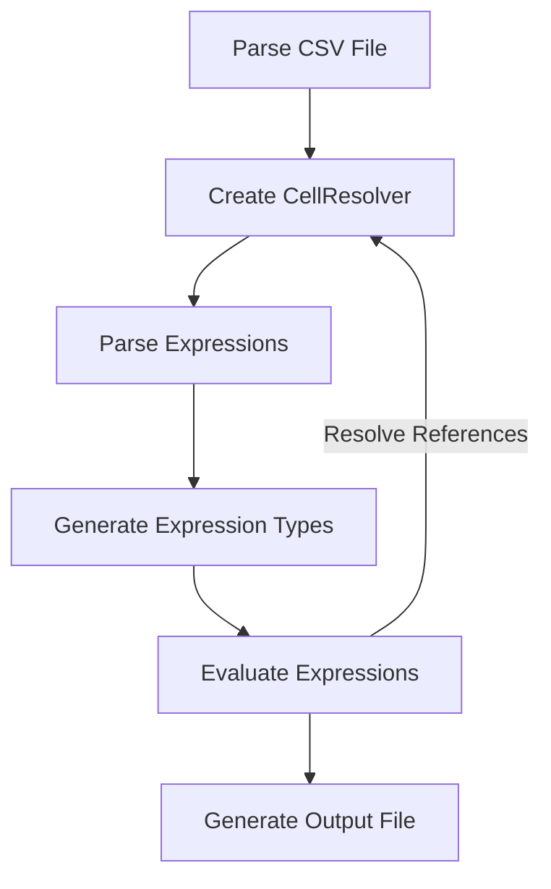

# Staking Reward Challenge
Originally challenge is described [here](https://github.com/stakingrewards/engineering-challenge).

# Solution
This is not a complete solution but I think it is enough to show how I would approach solving such a problem and also some implementations of sub-problem. 

I was thinking the problem will have sub parts namely:
- csv parser: parses csv and allows the cell resolver to interact with the contents of the file
- cell resolver: can be used to retrieve each cell information
- expression parser: parses an expression and generates a expression type
- expression evaluator: reduces an expression as much as possible.

In this repo I have defined `expression types` and provided an implementation for `expression evaluator`. The overall flow expression types will be generated by `expression parser` and passed down to `expression evaluator` is as follows:

